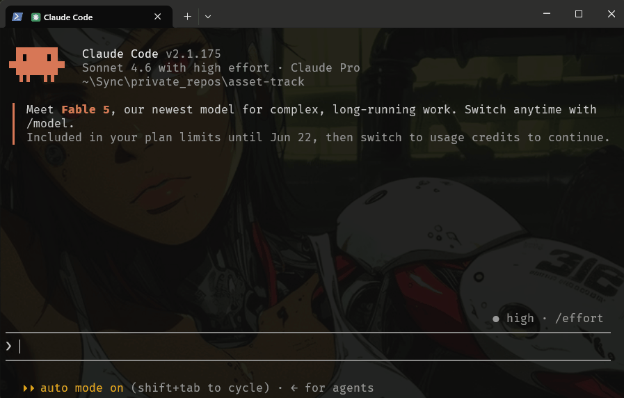

# Super Copy

A CLI tool for deploying files from registered sources to registered destinations, with tracking, re-sync, and ghost support (remove and restore tracked files).

Designed for single-user, local workflows: dotfiles, config files, Claude Code agents, or any asset you distribute across machines and projects.



## Install

```sh
npm install -g @koder0x/scopy@next
```

> Current version: `0.2.19-rc.2` — stable release coming soon. `@next` installs the current release candidate.

## How it works

Register sources (GitHub repos or local directories) and destinations (local directories), then sync files between them. GitHub sources are fetched directly via the GitHub API — no local Git installation required. Every copy is tracked so you can re-sync, inspect history, or ghost files without losing the originals.

## Commands

```sh
# Sources
scopy source add <name> <url|path>   # register a git repo or local directory
scopy source remove <name>           # remove a registered source
scopy source list                    # list registered sources

# Destinations
scopy dest add <name> <path>         # register a local directory
scopy dest remove <name>             # remove a registered destination
scopy dest list                      # list registered destinations

# Sync
scopy sync <source>[/<glob>] <dest>  # copy files; existing files → interactive overwrite selector
scopy sync ... --force               # overwrite all without prompting
scopy resync <dest>                  # re-copy all tracked files from their original sources

# History & state
scopy log [dest]                     # show copy history grouped by destination
scopy ghost [dest] [selector]        # toggle file(s) ghosted/present; no args → interactive grouped view
scopy purge log <dest|*>             # remove log entries (asks confirmation)
scopy purge log <dest|*> --force     # remove log entries without prompting

# Config & info
scopy config [key] [value]           # get or set preferences (e.g. sync.allowOverwrite)
scopy info                           # show config path and registered locations
```

## Example

```sh
# Register Claude Code agents repo and a project-level destination
scopy source add cc-agents https://github.com/gsscoder/claude-coding-agents
scopy dest add my-project /path/to/your/project/.claude/agents

# Sync all implement agents
scopy sync cc-agents/agents/implement/*.md my-project

# Re-sync after upstream updates
scopy resync my-project

# Check log to find index, then ghost by index, filename, or wildcard
scopy log my-project
scopy ghost my-project 6
scopy ghost my-project task-builder.md
scopy ghost my-project task-*

# Or use interactive mode — all destinations and files in one grouped view
scopy ghost
```

## Requirements

- Node.js >= 20

## License

MIT © [koder0x](https://github.com/gsscoder)
